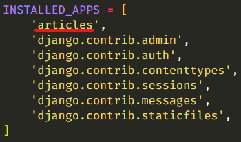

# My First Django Project

## 1. Start Project

1. **가상 환경 설정**

   - `python -m venv venv`

     'venv' 이름으로 가상환경 생성

     

   - `source venv/Scripts/activae`

     만든 가상환경을 실행하면 명령창에 가상환경의 이름이 붙는다 (venv)

     

   - `pip list`

     설치된 패키지 리스트 확인을 통해 제대로 가상환경이 만들어졌는지 확인한다.

     
     `WARNING`은 pip 버전 경고이므로 무시해도 좋다

2. **Django 설치**

   - `pip install django`

     django를 설치한다

     
     `Successfully installed asgiref-3.2.10 django-3.1.1 pytz-2020.1 sqlparse-0.3.1` 라는 문구가 뜨면 정상적으로 설치가 된 것이다.

     `pip list`로 django가 제대로 설치되었는지 확인할 수 있다.

     

     - 특정 버전 django 설치: `pip install django==3.0.8`

3. **.gitignore 생성**

   [gitignore.io](https://www.toptal.com/developers/gitignore)에서 `django`, `visualstudiocode`, `python`, `venv` 키워드로 .gitignore 파일 생성

4. **requirements.txt 생성**

   - `pip freeze > requirements.txt`

     해당 프로젝트에 필요한 모듈, 패키지를 버전과 함께 기록

     

5. **프로젝트 생성**

   - `django-admin startproject 프로젝트명 .`

     맨 뒤에 `.`(현재 경로라는 의미)를 붙이지 않으면 프로젝트명의 폴더를 만들고, 그 안에 프로젝트를 생성해준다.

     여기서는 이미 프로젝트 명(my_first_djang_project)의 폴더에서 진행되기 때문에 따로 폴더를 더 만들지 않았다.

     

   - `python manage.py runserver`

     django 프로젝트가 잘 생성되었는지 서버를 실행시켜본다.

     

     `http://127.0.0.1:8000/` 해당 url로 들어가면 django 프로젝트 화면을 볼 수 있다.

     

   - 프로젝트 언어 및 지역(시간) 설정

     프로젝트 폴더의 `settings.py` 파일에서 `LANGUAGE_CODE`와 `TIME_ZONE` 변수 값을 다음과 같이 설정

     ```python
     # settings.py

     LANGUAGE_CODE = 'ko-kr'

     TIME_ZONE = 'Asia/Seoul'
     ```

     그러면 프로젝트 언어와 시간이 한국기준으로 바뀐다.
     

## 2. Start APP

1. **앱 생성**

   - `python manage.py startapp articles` 명령어를 통해 'articles'라는 앱을 생성

     

   - 프로젝트 `settings.py`에 앱을 등록

     - settings.py

       

2. **모델 생성**

   `models.py`에서 모델 클래스를 정의한다.

   ```python
   from django.db import models
   
   
   class Article(models.Model):
       title = models.CharField(max_length=50)
       content = models.TextField()
       created_at = models.DateTimeField(auto_now_add=True)
       modified_at = models.DateTimeField(auto_now=True)
   
   ```

   - `models.Model`

     - 모델 클래스는 기본적으로 django의 Model 클래스를 상속 받아야 한다.

   - Fields

     - [`CharField(max_length=None)`](https://docs.djangoproject.com/en/3.1/ref/models/fields/#charfield)

       문자열의 최대 길이을 뜻하는, `max_length` 키워드 인자가 필수

     - [`TextField(**options)`](https://docs.djangoproject.com/en/3.1/ref/models/fields/#charfield)

       A large text field.

     - [`DateTimeField(auto_now=False, auto_now_add=False, **options)`](https://docs.djangoproject.com/en/3.1/ref/models/fields/#datetimefield)

       날짜와 시간.

       - auto_now

         Automatically set the field to now every time the object is saved.  
         오브젝트가 수정 될 때마다 그 시간을 자동으로 저장.

       - auto_now_add

         Automatically set the field to now when the object is first created.  
         오브젝트가 처음으로 생성될 때 그 시간을 자동으로 저장.

     - [`DateField(auto_now=False, auto_now_add=False, **options)`](https://docs.djangoproject.com/en/3.1/ref/models/fields/#datefield)

       DateTimeField와 다르게 시간을 제외한 날짜만 표시.

3. 마이그레이션

   django가 모델의 버전을 관리하는 방식

   - `python manage.py makemigrations`

     현재의 마이그레이션 생성  
     

   - `python manage.py migrate`

     마이그레이션을 이용해 DB 스키마를 만든다.

## 3. Admin

Django 프로젝트를 생성하면 자동적으로 `django.contrib.admin`이라는 내장 앱이 설치되어 있다.  
이 앱은 프로젝트 관리를 위한 관리자 앱이다.  
`/admin` url로 이동하면 관리자 페이지가 나온다.  


관리자 페이지를 이용하려면 관리자 계정이 필요한데 `python manage.py createsuperuser` 명령어로 생성할 수 있다.  


관리자 페이지에서 생성한 모델의 스키마에 있는 데이터를 조회, 생성, 수정, 삭제할 수 있다.  
그러기 위해서 우선적으로 해당 앱의 `admin.py` 파일에 모델을 등록해 주어야 한다.  

```python
from django.contrib import admin
from .models import Article

admin.site.register(Article)
```

등록 후 관리자 페이지에 로그인 하면 해당 모델을 볼 수 있다.  


여기서 모델 객체(데이터)를 생성할 수 있다.

## 4. shell_plus

### shell

django의 모델의 객체 조회, 생성, 수정, 삭제는 shell, 즉 CLI를 통해서도 수행할 수 있는데, `python manage.py shell`을 실행하면 된다.  


### shell_plus란?

shell의 경우에는 그에 관련된 모듈을 일일이 import 해주어야 하는 불편함이 있다. 이러한 불편함을 해결하기 위해 `django_extensions`라는 패키지 앱의 `shell_plus`를 이용한다.

- `pip install django-extensions` 명령어를 통해 django_extensions를 설치한다
- 프로젝트의 `settings.py`에 `INSTALLED_APPS`에 `django_extensions`를 추가해준다.  
  주의 해야하는 점은 하이픈(`-`)이 아니라 언더스코어(`_`)로 작성해야 한다. 그렇지 않으면 `ModuleNotFoundError`가 발생한다.
- `python manage.py shell_plus` 명령어로 실행하면 모델과 장고에 필요한 모듈들이 자동으로 import 되며 시작된다.  
  
- 추가적으로 `pip install ipython`으로 ipython을 설치하면 ipython 콘솔로 나온다.  
  ipython 콘솔은 기존 python 콘솔에 비해 하이라이팅이 보여지고 인텔리센스 기능이 편리하다는 장점이 있다.  
  

### shell_plus로 DB 데이터 조작하기

- **데이터 생성하기(Create)**

  데이터 객체를 생성하는 방법은 3가지가 있다.

  1. 첫 번째 방법

     

     마지막에 `.save()`를 하지 않으면 DB에 저장되지 않는다.

  2. 두 번째 방법

     

     여기서도 마찬가지로 마지막에 `.save()`를 하지 않으면 DB에 저장 되지 않는다.

  3. 세 번째 방법

     

     이 방법은 생성과 동시에 저장까지 완료한다. 변수에 할당하면 생성된 것을 바로 변수에 담을 수도 있다.

- **데이터 조회하기(Read)**

  - 해당 모델의 모든 데이터 조회하기

    `모델클래스.objects.all()`을 통해 모든 데이터 객체들을 가져 올 수 있다.  
    

    가져온 객체들은 `QuerySet`이라는 자료구조에 담겨오는데, 이는 파이썬 리스트처럼 인덱싱할 수 있다.  
    

    슬라이싱도 가능하다  
    

  - 특정 모델의 데이터 1개 조회하기

    데이터 객체들은 기본키(primary key)를 가지고 있는데, 이는 객체의 `pk`라는 필드에 저장되어 있다.  
    `모델클래스.objects.get(pk=1)` 로 1을 pk로 가지는 객체를 조회할 수 있다.  
    

    여기서 `<Article: Article object (1)>`의 1이 바로 pk값 1을 나타낸다.  
    이때 all()과 다른 점은 `QuerySet`에 담겨서 리턴 되는 것이 아니라 객체 하나만 리턴된다.

    `.objects.get`은 pk외에도 다른 필드를 통해 조회할 수도 있다.  
    

    하지만 **주의할 점은 get은 조회된 데이터가 무조건 1개여야 한다!**  
    그렇지 않으면 `MultipleObjectsReturned` 에러가 발생한다.  
    

  - 특정 데이터 여러개 조회하기

    get말고 filter를 이용하면 된다.  
    `모델클래스.objects.filter(필드=필드값)`  
    

    이는 객체가 기본적으로 여러 개이기 때문에 `QuerySet`에 담겨서 리턴된다.  
    비록 조회된 데이터가 0개 또는 1개일 때도 마찬가지다.

- **데이터 수정하기(Update)**

  수정은 간단하다. 조회한 객체의 필드 값을 변경후 `.save()`하면 된다.  
  

- **데이터 삭제하기(Delete)**

  조회한 객체의 `.delete()`메소드를 호출하면 된다.  
  

## 5. CRUD

### CREATE

- my_first_django_project/urls.py

  Article을 생성할 페이지의 url을 만든다.

  ```python
  from django.contrib import admin
  from django.urls import path
  from articles import views
  
  urlpatterns = [
      path('admin/', admin.site.urls),
      path('articles/new', views.new),
      
  ]
  ```

  - 주의할 점
    - url이 `/~`로 시작되면 `/`은 루트를 의미

- articles/views.py

  생성 페이지를 렌더링할 함수 new

  ```python
  def new(request):
      return render(request, 'new.html')
  ```

- articles/template/new.html

  ```html
  <!DOCTYPE html>
  <html lang="en">
  <head>
    <meta charset="UTF-8">
    <meta name="viewport" content="width=device-width, initial-scale=1.0">
    <title>Document</title>
  </head>
  <body>
    <h1>New Page</h1>
    <form action="" method="post">
      <label for="title">제목</label>
      <input type="text" name="title">
      <label for="content">내용</label>
      <textarea name="content" cols="30" rows="10"></textarea>
      <input type="submit" value="등록">
    </form>
  </body>
  </html>
  ```

- 결과

  

----

아직 생성 페이지만 만들었고 '등록'을 눌러도 실제로 글이 저장되는 기능은 구현되어 있지 않다.

- 글을 작성해서 form을 POST 요청으로 보낼 url로 `path('articles/create', views.create)`을 url.py에 추가한다.

  ```python
  from django.contrib import admin
  from django.urls import path
  from articles import views
  
  urlpatterns = [
      path('admin/', admin.site.urls),
      path('articles/new/', views.new),
      path('articels/create/', views.create),	# 추가
  ]
  ```

- views.py에 요청을 저장할 함수 `create()`를 작성

  ```python
  def create(request):
      article = Article()
      
      title = request.POST.get('title')
      content = request.POST.get('content')
      
      article.title = title
      article.content = content
      
      article.save()
      
      return redirect('/articles/new/')
  ```

  글 저장이 잘 이루어지면 new 페이지로 리다이렉트 시킨다.  
  원래는 조회 페이지나 index 페이지로 돌아가야하지만 아직 만들기 전이므로 new 페이지로 리다이렉트 시켰다.

- 이제 new.html의 form의 action 속성값으로 create의 url을 넣어준다.

  ```html
  <form action="/articles/create/" method="post">
      <label for="title">제목</label>
      <input type="text" name="title">
      <label for="content">내용</label>
      <textarea name="content" cols="30" rows="10"></textarea>
      <input type="submit" value="등록">
  </form>
  ```

  여기서 url이 `/`으로 시작하면은 domain 루트 주소에 이어 붙어서 나오고, `/`없이 시작하면 현재 경로에 붙어서 나온다.  
  예를 들어 `/articles/create/`의 경우 `127.0.0.1:8000/articles/create/`를 의미하지만  
  `articles/create`는 `127.0.0.1:8000/articles/new/articles/create/`처럼 현재 경로 `~/new/`에 이어 붙이는 것을 의미한다.

- 이제 글을 작성하고 등록을 누르면 CSRF 검증이 실패한다고 나온다.

  

  이를 해결하기 위해서는 Django의 모든 form 태그 안에는 CSRF token을 넣어주어야 한다.  
  form 태그 안에 ``을 넣어주면 된다.

  ```html
  <form action="/articles/create/" method="post">
      
      <label for="title">제목</label>
      <input type="text" name="title">
      <label for="content">내용</label>
      <textarea name="content" cols="30" rows="10"></textarea>
      <input type="submit" value="등록">
    </form>
  ```

### READ

#### index 페이지

글을 작성했으면 이제 조회할 페이지를 만든다. articles 앱의 index 페이지에 모든 글의 목록을 보이도록 할 것이다.

- urls.py에 index 페이지의 path로 `path('articles/', views.index)`를 추가한다.

- views.py에 index 페이지를 render할 `index`함수를 작성한다.

  ```python
  def index(request):
      articles = Article.objects.all()
      
      context = {
          'articles': articles
      }
      
      return render(request, 'index.html', context)
  ```

  `모델클래스.objects.all()`을 통해 모델의 모든 데이터를 불러올 수 있다.  
  이를 페이지로 context에 딕셔너리로 담아서 넘기면 html에서 참조할 수 있다.

- new.html

  `index`함수에서 건네 받은 articles를 for 태그를 이용해서 렌더링 한다.

  ```html
  <h1>Index Page</h1>
    
      <h3>{{ article.title }}</h3>
      <hr>
    
  </body>
  ```

- 결과

  

- 이제 index 페이지가 만들어졌으니 create 함수의 리다이렉트 주소를 index의 url로 바꾸어준다.  
  `redirect('/articles/')`

- index 페이지에서 new 페이지로 갈 수 있도록 anchor 태그를 추가한다.  
  그리고 new 페이지에서는 index 페이지로 돌아갈 수 있도록 anchor 태그를 추가한다.

  - index.html

    ```html
    <nav>
        <a href="/articles/new">New Page</a>
    </nav>
    ```

    

  - new.html

    ```html
    <nav>
        <a href="/articles/">Index Page</a>
    </nav>
    ```

    

----

#### detail 페이지

글 모든 목록 조회를 만들었다면, 이번에는 선택된 글의 상세 조회 페이지를 만든다.  
상세 조회 페이지에서는 글의 내용과 글의 작성 시간, 수정 시간을 조회할 수 있다.

- urls.py에 상세페이지를 위한 url로 `path('/articles/<int:article_pk>', views.detail)`를 추가한다.

  상세페이지는 특정한 글을 보여주는 것이므로 해당 글의 id(또는 pk)를 url에 포함 시켜야 한다.

- views.py에 `detail` 함수를 작성한다.

  ```python
  def detail(request, article_pk):
      article = Article.objects.get(pk=article_pk)
      context = {
          'article': article,
      }
      
      return render(request, 'detail.html', context)
  ```

  url로 넘겨지느 pk값은 views.py의 함수의 매개변수로 받아올 수 있다. **단, url의 이름과 매개변수의 이름이 동일해야 한다.**  
  이렇게 넘겨 받은 pk값을 이용해 `모델클래스.objects.get(pk=값)`을 통해 데이터를 불러올 수 있다.

- detail.html

  ```html
  <body>
    <nav>
      <a href="/articles/">Index Page</a>
    </nav>
    <h1>Detail Page</h1>
    <hr>
    <h3>제목 : {{ article.title }}</h3>
    <p>내용 : {{ article.content }}</p>
    <footer>
      <p>작성일 : {{ article.created_at }}</p>
      <p>수정일 : {{ article.modified_at }}</p>
    </footer>
  </body>
  ```

- 결과

  

- 이제 index 페이지에서 글의 제목을 눌렀을 때 해당 글의 detail 페이지로 이동할 수 있도록  
   `<h3><a href="/articles/{{ article.pk }}/">{{ article.title }}</a></h3>` 이렇게 index.html에서 글의 제목 부분을 수정한다.

### UPDATE

#### edit 페이지

글의 수정 페이지를 만든다.

- 수정 페이지를 요청할 url을 url.py에 `path('/articles/<int:article_pk>/edit', views.edit)`를 추가한다.

- views.py에 `edit` 함수를 정의한다.

  ```python
  def edit(request, article_pk):
      return render(request, 'edit.html')
  ```

- edit.html

  ```html
  <body>
      <h1>Edit Page</h1>
      <hr>
  
      <form action="" method="post">
          
          <label for="title">제목</label>
          <input type="text" name="title">
          <label for="content">내용</label>
          <textarea name="content" cols="30" rows="10"></textarea>
      </form>
  </body>
  ```

- 결과 사진

  

  페이지는 잘 나오지만 문제가 있다.  
  보통 수정 페이지는 수정하고자하는 글의 현재 상태가 보여져야하는데 input들이 빈 상태로 나온다. 이를 위해서 `edit` 함수에서 해당 글의 정보를 페이지에 넘겨주어야 한다.

- 수정된 edit 함수

  ```python
  def edit(request, article_pk):
      # 해당 글을 조회하여 context에 담아서 넘긴다
      article = Article.objects.get(pk=article_pk)
      context = {
          'article': article
      }
      return render(request, 'edit.html', context)
  ```

- 수정된 edit.html

  ```html
  <body>
      <h1>Edit Page</h1>
      <hr>
  
      <form action="" method="post">
          
          <label for="title">제목</label>
          <input type="text" name="title" value="{{ article.title }}">
          <label for="content">내용</label>
          <textarea name="content" cols="30" rows="10">{{ article.content }}</textarea>
          <input type="submit" value="수정">
      </form>
  </body>
  ```

- 수정된 결과 사진

  

#### update 함수

글의 수정 페이지는 만들었지만 수정 로직을 만들지는 않았기 때문에 수정 버튼이 작동하지 않는다. 

- url.py에 글 수정 요청 url로 `path('articles/<int:article_pk>/update', views.update)`를 추가한다.

- views.py에서 `update` 함수를 정의한다.

  수정된 정보는 request.POST에 담겨있으므로 `request.POST.get()` 메소드로 불러온다.

  ```python
  def update(request, article_pk):
      article = Article.objects.get(pk=article_pk)
      
      title = request.POST.get('title')
      content = request.POST.get('content')
      
      article.title = title
      article.content = content
      
      article.save()
      
      return redirect(f'/articles/{article_pk}/')
  ```

- edit.html에서 form의 action 값을 update url로 수정한다.  
  `<form action="/articles/update" method="post">`

### DELETE

글 삭제 로직을 작성한다. 글 삭제의 경우 삭제를 위한 페이지가 따로 존재하지 않고, detail 페이지에 삭제 버튼을 만들어 그것으로 삭제 요청을 보내도록 한다.

- urls.py에 삭제 요청을 보낼 url로 `path('articles/<int:article_pk>/delete', views.delete)`을 추가한다.

- views.py에 `delete`함수를 정의한다.

  ```python
  def delete(request, article_pk):
      article = Article.objects.get(pk=article_pk)
      article.delete()
      return redirect('/articles/')
  ```

- detail.html에 삭제 버튼을 추가한다.

  삭제는 DB의 내용을 수정하는 것이므로 POST 요청으로 보내야하 하므로 form태그를 이용한다.

  ```html
  <form action="/articles/{{ article.pk }}/delete" method="post">
      
      <input type="submit" value="삭제">
  </form>
  ```

## 6. 문제점 및 해결방법

### (1) url에 대한 문제점

1. url 수정 애로사항

   url.py에 등록한 각각의 url들은 여러 템플릿과 뷰함수에 쓰인다.  
   예를 들어, index 페이지의 url `articles/`는 모든 페이지 html 파일의 네비게이션에 작성되어 있고, index 페이지를 렌더링 또는 index 페이지로 리다이렉트 시키는 모든 뷰 함수에서 사용된다.  
   만일 이 상황에서 url을 수정해야하는 상황이 생긴다면 이 url을 참조하고 있는 모든 곳을 수정해야하는 상황이 발생한다.

   - 이를 위해 url에 이름을 부여하여 그 이름을 url로 대신할 수 있다. 마치 url을 변수에 담아서 사용하는 것과 같다.

   - 변수에 이름을 넣기 위해서 path에 `name` 키워드 인자를 추가하면 된다.

   - url들에 이름을 추가한 urls.py

     ```python
     urlpatterns = [
         path('admin/', admin.site.urls),
         path('articles/new/', views.new, name='new'),
         path('articles/create/', views.create, name='create'),
         path('articles/', views.index, name='index'),
         path('articles/<int:article_pk>/', views.detail, name='detail'),
         path('articles/<int:article_pk>/edit', views.edit, name='edit'),
         path('articles/<int:article_pk>/update', views.update, name='update'),
         path('articles/<int:article_pk>/delete', views.delete, name='delete'),
     ]
     ```

   - 이제는 index 페이지의 url, `/articles/` 대신에 `index`라는 이름을 사용하면 된다.

     - `rediect('/articles/')` -> `redirect('index')`

     - `<a href="/articels/">` -> `<a href=""`

       html에서는 `` 장고 템플릿 언어를 사용한다.

     - `<a href="/articles/{{ article.pk }}/">` -> `<a href=" "`

       동적 url의 경우, `변수 명=값`을 명시해준다. 이때, 공백이 있어서는 안 된다. 예를 들어 `article_pk = article.pk`는 파싱 에러가 발생한다.  
       또는 값을 url의 변수 순서대로 넣으면 알아서 값이 매칭된다.  
       예를 들어, `<a href="">` 이렇게 작성하여도 무방한다.

     - `redirect('detail', article_pk)`

       동적 url로 리다이렉트 시에 넣을 변수 값을 매개변수로 넘긴다.

2. url 중복 애로사항

   이렇게 프로젝트를 확장시켜 간다면 앱도 여러개가 되고, 각각의 앱들의 url들이 필요하다. 그러면 이 모든 url들을 urls.py에서 관리하게 되는데, 하나의 파일에 너무 많은 url들이 있어서 불편할 뿐더러 url의 name이 겹쳐 불편해질 수 있다.  
   예를 들어, index 페이지가 articles라는 앱에만 존재한다는 보장이 없다. 여러 앱들이 index 페이지가 있을 것이고 그것들도 url 이름을 index라고 짓고 싶지만 articles의 index 페이지가 `index` url 이름을 사용하고 있으므로 다른 앱들의 index 페이지는 다른 url 이름을 사용해야 한다. **이를 해결하기 위해 url 분리 작업을 한다.**

   - articles/urls.py

     ```python
     from django.urls import path
     from . import views
     
     app_name = 'articles'
     urlpatterns = [
         path('new/', views.new, name='new'),
         path('create/', views.create, name='create'),
         path('', views.index, name='index'),
         path('<int:article_pk>/', views.detail, name='detail'),
         path('<int:article_pk>/edit', views.edit, name='edit'),
         path('<int:article_pk>/update', views.update, name='update'),
         path('<int:article_pk>/delete', views.delete, name='delete'),
     ]
     ```

     articles 앱의 폴더에 urls.py 파일을 만들고, 해당 앱의 url들을 모두 옮겨온다. 이 때 `app_name` 변수를 앱의 이름인 `'articles'` 를 문자열 타입으로 선언한다.  
     그리고 url 패턴에서 `articles/`을 제거한다. 이제 이 url 들은 앞에 명시가 되어 있지 않더라도 `articles/`로 시작하게 된다.

   - my_first_django_project/urls.py

     ```python
     from django.contrib import admin
     from django.urls import path, include
     from articles import views
     
     urlpatterns = [
         path('admin/', admin.site.urls),
         path('articles/', include('articles.urls')),
     ]
     ```

     이제 `articles/`로 시작하는 url 요청은 모두 `articles/urls.py`에서 찾도록  
     `path('articles/', include('articles.urls'))` 이렇게 설정한다.

   - 이렇게 url을 분리 후에 해당 url 들을 url 이름으로 참조할 때 항상 어느 앱의 url 이름인지 `앱이름:url이름` 형식으로 명시를 해주어야 한다. 

     - `` -> ``
     - `redirect('index')` - >`redirect('articles:index')`

### (2) Template에 대한 문제점

템플릿의 가장 큰 문제점은 중복이 많다는 점이다. 예를 들어, 네비게이션은 모든 페이지에 똑같이 존재하기 때문에 모든 템플릿 html 파일에 작성해주어야 한다. 2~3 페이지라면 문제가 되지 않겠지만 수십, 수백 페이지라면, 그 모든 페이지에 복사해서 붙여 넣기란 귀찮기 짝이 없다.  
더 큰 문제는 수정이다. 우리가 이미 위에서 url 수정 작업을 거쳤는데 고작 4 페이지를 수정하는 데에도 많은 부분을 수정해야 했다. 왜냐하면 모든 페이지에 거의 같은 코드가 쓰였기 때문이다.

#### 템플릿 상속

모든 페이지에 있어야 할 요소들을 가지고 있는 **액자 같은 틀의 역할**을 하는 템플릿을 만들고, 그 템플릿 안에 다른 템플릿을 끼워 넣을 수 있는 기능을 말한다.

- 부모 템플릿 파일을 프로젝트 내에 만든다.  
  본인의 경우 ``/my_first_django_project/templates/base.html` 에 만들었다.

  ```html
  <!DOCTYPE html>
  <html lang="en">
  <head>
    <meta charset="UTF-8">
    <meta name="viewport" content="width=device-width, initial-scale=1.0">
    <title>Document</title>
  </head>
  <body>
    <nav>
      <a href="">Index Page</a>
      <a href="">New Page</a>
    </nav>
    
    
  </body>
  </html>
  ```

  모든 페이지에 공통으로 있어야 할 부분들 `html`, `head`, `body`, `nav` 태그만 작성하고, 다른 템플릿의 내용이 담길 공간에 ``을 작성한다.

- 이제 부모 템플릿을 참조할 수 있도록 이 경로를 settings.py에 등록해야한다.

  ```python
  TEMPLATES = [
      {
          'BACKEND': 'django.template.backends.django.DjangoTemplates',
          'DIRS': [BASE_DIR / 'my_first_django_project' / 'templates'], # 여기
          'APP_DIRS': True,
          'OPTIONS': {
              'context_processors': [
                  'django.template.context_processors.debug',
                  'django.template.context_processors.request',
                  'django.contrib.auth.context_processors.auth',
                  'django.contrib.messages.context_processors.messages',
              ],
          },
      },
  ]
  ```

  여기서 `BASE_DIR`은 프로젝트의 뿌리(?) 경로로 settings.py 내에서 기본적으로  
  `BASE_DIR = Path(__file__).resolve().parent.parent`  
  이렇게 정의 되어 있다. 이를 중심으로 적절히 경로를 추가하여 부모 템플릿이 담긴 경로를 작성해준다.
  
- 이제 각각의 페이지 템플릿을 상속을 이용해 수정한다.  
  상속 받고자 하는 템플릿을 ``으로 추가하고 그 부모 템플릿의 block에 들어갈 내용을 작성하면 된다.

  - index.html

    ```html
    
    
      <h1>Index Page</h1>
      
        <h3><a href="">{{ article.title }}</a></h3>
        <hr>
      
    
    ```

#### 동적 템플릿

new 페이지와 edit 페이지는 사실 상 같은 형태고, 안의 내용이 채워져 있냐 없냐와 버튼이 수정인가 새 글 작성인가의 차이 뿐이다. 같은 탬플릿을 이용해 요청된 url에 따라 안의 내용을 달리 해보자.

- edit.html

  `{{ request.resolver_match.url_name }}`을 통해서 현재의 url 이름을 알 수 있고, 이를 이용해서 if-elif 태그를 통해 url 이름에 따라 다르게 렌더링 할 수 있다.

  ```html
  
  
  
  
  
  <h1>New Page</h1>
  
  <h1>Edit Page</h1>
  
  
  <hr>
  
  
  <form action="" method="post">
  
  <form action="" method="post">
  
    
    <label for="title">제목</label>
    <input type="text" name="title" value="{{ article.title }}">
    <label for="content">내용</label>
    <textarea name="content" cols="30" rows="10">{{ article.content }}</textarea>
    <input type="submit" value="수정">
  </form>
  
  ```

- 이제 new.html 파일은 필요 없으므로 삭제해도 된다.

### (3) 뷰 함수에 대한 문제점

새글 작성과 글 수정의 경우 페이지를 렌더링 하는 함수와 DB에 저장 또는 수정하는 함수가 따로 작성되어 있다. 하지만 페이지 요청은 GET, DB 조작은 POST로 요청 메소드가 나뉘어져 있기 때문에 하나의 뷰 함수에서 요청에 따라 다른 로직이 수행되도록 한다면 함수를 하나만 작성하면 된다. 이렇게 되면 url도 두 개로 나뉠 필요 없이 하나만 사용할 수 있다.  
즉, 하나의 url이 GET이냐 POST냐에 따라 다르게 응답하게 한다는 것이다.

- new와 create를 병합

  ```python
  def create(request):
      
      if request.method == 'POST':
          article = Article()
          
          title = request.POST.get('title')
          content = request.POST.get('content')
          
          article.title = title
          article.content = content
          
          article.save()
          
          return redirect('articles:index')
      
      return render(request, 'edit.html')
  ```

- edit과 update 병합

  ```python
  
  ```

  

