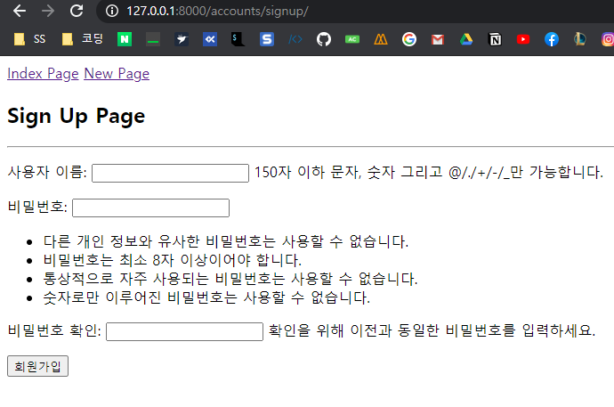
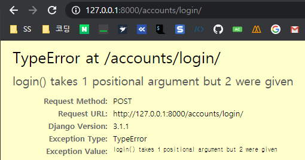

# My First Django Project

## 1. Start Project

1. **가상 환경 설정**

   - `python -m venv venv`

     'venv' 이름으로 가상환경 생성

     

   - `source venv/Scripts/activae`

     만든 가상환경을 실행하면 명령창에 가상환경의 이름이 붙는다 (venv)

     

   - `pip list`

     설치된 패키지 리스트 확인을 통해 제대로 가상환경이 만들어졌는지 확인한다.

     
     `WARNING`은 pip 버전 경고이므로 무시해도 좋다

2. **Django 설치**

   - `pip install django`

     django를 설치한다

     
     `Successfully installed asgiref-3.2.10 django-3.1.1 pytz-2020.1 sqlparse-0.3.1` 라는 문구가 뜨면 정상적으로 설치가 된 것이다.

     `pip list`로 django가 제대로 설치되었는지 확인할 수 있다.

     

     - 특정 버전 django 설치: `pip install django==3.0.8`

3. **.gitignore 생성**

   [gitignore.io](https://www.toptal.com/developers/gitignore)에서 `django`, `visualstudiocode`, `python`, `venv` 키워드로 .gitignore 파일 생성

4. **requirements.txt 생성**

   - `pip freeze > requirements.txt`

     해당 프로젝트에 필요한 모듈, 패키지를 버전과 함께 기록

     

5. **프로젝트 생성**

   - `django-admin startproject 프로젝트명 .`

     맨 뒤에 `.`(현재 경로라는 의미)를 붙이지 않으면 프로젝트명의 폴더를 만들고, 그 안에 프로젝트를 생성해준다.

     여기서는 이미 프로젝트 명(my_first_djang_project)의 폴더에서 진행되기 때문에 따로 폴더를 더 만들지 않았다.

     

   - `python manage.py runserver`

     django 프로젝트가 잘 생성되었는지 서버를 실행시켜본다.

     

     `http://127.0.0.1:8000/` 해당 url로 들어가면 django 프로젝트 화면을 볼 수 있다.

     

   - 프로젝트 언어 및 지역(시간) 설정

     프로젝트 폴더의 `settings.py` 파일에서 `LANGUAGE_CODE`와 `TIME_ZONE` 변수 값을 다음과 같이 설정

     ```python
     # settings.py

     LANGUAGE_CODE = 'ko-kr'

     TIME_ZONE = 'Asia/Seoul'
     ```

     그러면 프로젝트 언어와 시간이 한국기준으로 바뀐다.
     

## 2. Start APP

1. **앱 생성**

   - `python manage.py startapp articles` 명령어를 통해 'articles'라는 앱을 생성

     

   - 프로젝트 `settings.py`에 앱을 등록

     - settings.py

       

2. **모델 생성**

   `models.py`에서 모델 클래스를 정의한다.

   ```python
   from django.db import models
   
   
   class Article(models.Model):
       title = models.CharField(max_length=50)
       content = models.TextField()
       created_at = models.DateTimeField(auto_now_add=True)
       modified_at = models.DateTimeField(auto_now=True)
   
   ```

   - `models.Model`

     - 모델 클래스는 기본적으로 django의 Model 클래스를 상속 받아야 한다.

   - Fields

     - [`CharField(max_length=None)`](https://docs.djangoproject.com/en/3.1/ref/models/fields/#charfield)

       문자열의 최대 길이을 뜻하는, `max_length` 키워드 인자가 필수

     - [`TextField(**options)`](https://docs.djangoproject.com/en/3.1/ref/models/fields/#charfield)

       A large text field.

     - [`DateTimeField(auto_now=False, auto_now_add=False, **options)`](https://docs.djangoproject.com/en/3.1/ref/models/fields/#datetimefield)

       날짜와 시간.

       - auto_now

         Automatically set the field to now every time the object is saved.  
         오브젝트가 수정 될 때마다 그 시간을 자동으로 저장.

       - auto_now_add

         Automatically set the field to now when the object is first created.  
         오브젝트가 처음으로 생성될 때 그 시간을 자동으로 저장.

     - [`DateField(auto_now=False, auto_now_add=False, **options)`](https://docs.djangoproject.com/en/3.1/ref/models/fields/#datefield)

       DateTimeField와 다르게 시간을 제외한 날짜만 표시.

3. 마이그레이션

   django가 모델의 버전을 관리하는 방식

   - `python manage.py makemigrations`

     현재의 마이그레이션 생성  
     

   - `python manage.py migrate`

     마이그레이션을 이용해 DB 스키마를 만든다.

## 3. Admin

Django 프로젝트를 생성하면 자동적으로 `django.contrib.admin`이라는 내장 앱이 설치되어 있다.  
이 앱은 프로젝트 관리를 위한 관리자 앱이다.  
`/admin` url로 이동하면 관리자 페이지가 나온다.  


관리자 페이지를 이용하려면 관리자 계정이 필요한데 `python manage.py createsuperuser` 명령어로 생성할 수 있다.  


관리자 페이지에서 생성한 모델의 스키마에 있는 데이터를 조회, 생성, 수정, 삭제할 수 있다.  
그러기 위해서 우선적으로 해당 앱의 `admin.py` 파일에 모델을 등록해 주어야 한다.  

```python
from django.contrib import admin
from .models import Article

admin.site.register(Article)
```

등록 후 관리자 페이지에 로그인 하면 해당 모델을 볼 수 있다.  


여기서 모델 객체(데이터)를 생성할 수 있다.

## 4. shell_plus

### shell

django의 모델의 객체 조회, 생성, 수정, 삭제는 shell, 즉 CLI를 통해서도 수행할 수 있는데, `python manage.py shell`을 실행하면 된다.  


### shell_plus란?

shell의 경우에는 그에 관련된 모듈을 일일이 import 해주어야 하는 불편함이 있다. 이러한 불편함을 해결하기 위해 `django_extensions`라는 패키지 앱의 `shell_plus`를 이용한다.

- `pip install django-extensions` 명령어를 통해 django_extensions를 설치한다
- 프로젝트의 `settings.py`에 `INSTALLED_APPS`에 `django_extensions`를 추가해준다.  
  주의 해야하는 점은 하이픈(`-`)이 아니라 언더스코어(`_`)로 작성해야 한다. 그렇지 않으면 `ModuleNotFoundError`가 발생한다.
- `python manage.py shell_plus` 명령어로 실행하면 모델과 장고에 필요한 모듈들이 자동으로 import 되며 시작된다.  
  
- 추가적으로 `pip install ipython`으로 ipython을 설치하면 ipython 콘솔로 나온다.  
  ipython 콘솔은 기존 python 콘솔에 비해 하이라이팅이 보여지고 인텔리센스 기능이 편리하다는 장점이 있다.  
  

### shell_plus로 DB 데이터 조작하기

- **데이터 생성하기(Create)**

  데이터 객체를 생성하는 방법은 3가지가 있다.

  1. 첫 번째 방법

     

     마지막에 `.save()`를 하지 않으면 DB에 저장되지 않는다.

  2. 두 번째 방법

     

     여기서도 마찬가지로 마지막에 `.save()`를 하지 않으면 DB에 저장 되지 않는다.

  3. 세 번째 방법

     

     이 방법은 생성과 동시에 저장까지 완료한다. 변수에 할당하면 생성된 것을 바로 변수에 담을 수도 있다.

- **데이터 조회하기(Read)**

  - 해당 모델의 모든 데이터 조회하기

    `모델클래스.objects.all()`을 통해 모든 데이터 객체들을 가져 올 수 있다.  
    

    가져온 객체들은 `QuerySet`이라는 자료구조에 담겨오는데, 이는 파이썬 리스트처럼 인덱싱할 수 있다.  
    

    슬라이싱도 가능하다  
    

  - 특정 모델의 데이터 1개 조회하기

    데이터 객체들은 기본키(primary key)를 가지고 있는데, 이는 객체의 `pk`라는 필드에 저장되어 있다.  
    `모델클래스.objects.get(pk=1)` 로 1을 pk로 가지는 객체를 조회할 수 있다.  
    

    여기서 `<Article: Article object (1)>`의 1이 바로 pk값 1을 나타낸다.  
    이때 all()과 다른 점은 `QuerySet`에 담겨서 리턴 되는 것이 아니라 객체 하나만 리턴된다.

    `.objects.get`은 pk외에도 다른 필드를 통해 조회할 수도 있다.  
    

    하지만 **주의할 점은 get은 조회된 데이터가 무조건 1개여야 한다!**  
    그렇지 않으면 `MultipleObjectsReturned` 에러가 발생한다.  
    

  - 특정 데이터 여러개 조회하기

    get말고 filter를 이용하면 된다.  
    `모델클래스.objects.filter(필드=필드값)`  
    

    이는 객체가 기본적으로 여러 개이기 때문에 `QuerySet`에 담겨서 리턴된다.  
    비록 조회된 데이터가 0개 또는 1개일 때도 마찬가지다.

- **데이터 수정하기(Update)**

  수정은 간단하다. 조회한 객체의 필드 값을 변경후 `.save()`하면 된다.  
  

- **데이터 삭제하기(Delete)**

  조회한 객체의 `.delete()`메소드를 호출하면 된다.  
  

## 5. CRUD

### CREATE

- my_first_django_project/urls.py

  Article을 생성할 페이지의 url을 만든다.

  ```python
  from django.contrib import admin
  from django.urls import path
  from articles import views
  
  urlpatterns = [
      path('admin/', admin.site.urls),
      path('articles/new', views.new),
      
  ]
  ```

  - 주의할 점
    - url이 `/~`로 시작되면 `/`은 루트를 의미

- articles/views.py

  생성 페이지를 렌더링할 함수 new

  ```python
  def new(request):
      return render(request, 'new.html')
  ```

- articles/template/new.html

  ```html
  <!DOCTYPE html>
  <html lang="en">
  <head>
    <meta charset="UTF-8">
    <meta name="viewport" content="width=device-width, initial-scale=1.0">
    <title>Document</title>
  </head>
  <body>
    <h1>New Page</h1>
    <form action="" method="post">
      <label for="title">제목</label>
      <input type="text" name="title">
      <label for="content">내용</label>
      <textarea name="content" cols="30" rows="10"></textarea>
      <input type="submit" value="등록">
    </form>
  </body>
  </html>
  ```

- 결과

  

----

아직 생성 페이지만 만들었고 '등록'을 눌러도 실제로 글이 저장되는 기능은 구현되어 있지 않다.

- 글을 작성해서 form을 POST 요청으로 보낼 url로 `path('articles/create', views.create)`을 url.py에 추가한다.

  ```python
  from django.contrib import admin
  from django.urls import path
  from articles import views
  
  urlpatterns = [
      path('admin/', admin.site.urls),
      path('articles/new/', views.new),
      path('articels/create/', views.create),	# 추가
  ]
  ```

- views.py에 요청을 저장할 함수 `create()`를 작성

  ```python
  def create(request):
      article = Article()
      
      title = request.POST.get('title')
      content = request.POST.get('content')
      
      article.title = title
      article.content = content
      
      article.save()
      
      return redirect('/articles/new/')
  ```

  글 저장이 잘 이루어지면 new 페이지로 리다이렉트 시킨다.  
  원래는 조회 페이지나 index 페이지로 돌아가야하지만 아직 만들기 전이므로 new 페이지로 리다이렉트 시켰다.

- 이제 new.html의 form의 action 속성값으로 create의 url을 넣어준다.

  ```html
  <form action="/articles/create/" method="post">
      <label for="title">제목</label>
      <input type="text" name="title">
      <label for="content">내용</label>
      <textarea name="content" cols="30" rows="10"></textarea>
      <input type="submit" value="등록">
  </form>
  ```

  여기서 url이 `/`으로 시작하면은 domain 루트 주소에 이어 붙어서 나오고, `/`없이 시작하면 현재 경로에 붙어서 나온다.  
  예를 들어 `/articles/create/`의 경우 `127.0.0.1:8000/articles/create/`를 의미하지만  
  `articles/create`는 `127.0.0.1:8000/articles/new/articles/create/`처럼 현재 경로 `~/new/`에 이어 붙이는 것을 의미한다.

- 이제 글을 작성하고 등록을 누르면 CSRF 검증이 실패한다고 나온다.

  

  이를 해결하기 위해서는 Django의 모든 form 태그 안에는 CSRF token을 넣어주어야 한다.  
  form 태그 안에 ``을 넣어주면 된다.

  ```html
  <form action="/articles/create/" method="post">
      
      <label for="title">제목</label>
      <input type="text" name="title">
      <label for="content">내용</label>
      <textarea name="content" cols="30" rows="10"></textarea>
      <input type="submit" value="등록">
    </form>
  ```

### READ

#### index 페이지

글을 작성했으면 이제 조회할 페이지를 만든다. articles 앱의 index 페이지에 모든 글의 목록을 보이도록 할 것이다.

- urls.py에 index 페이지의 path로 `path('articles/', views.index)`를 추가한다.

- views.py에 index 페이지를 render할 `index`함수를 작성한다.

  ```python
  def index(request):
      articles = Article.objects.all()
      
      context = {
          'articles': articles
      }
      
      return render(request, 'index.html', context)
  ```

  `모델클래스.objects.all()`을 통해 모델의 모든 데이터를 불러올 수 있다.  
  이를 페이지로 context에 딕셔너리로 담아서 넘기면 html에서 참조할 수 있다.

- new.html

  `index`함수에서 건네 받은 articles를 for 태그를 이용해서 렌더링 한다.

  ```html
  <h1>Index Page</h1>
    
      <h3>{{ article.title }}</h3>
      <hr>
    
  </body>
  ```

- 결과

  

- 이제 index 페이지가 만들어졌으니 create 함수의 리다이렉트 주소를 index의 url로 바꾸어준다.  
  `redirect('/articles/')`

- index 페이지에서 new 페이지로 갈 수 있도록 anchor 태그를 추가한다.  
  그리고 new 페이지에서는 index 페이지로 돌아갈 수 있도록 anchor 태그를 추가한다.

  - index.html

    ```html
    <nav>
        <a href="/articles/new">New Page</a>
    </nav>
    ```

    

  - new.html

    ```html
    <nav>
        <a href="/articles/">Index Page</a>
    </nav>
    ```

    

----

#### detail 페이지

글 모든 목록 조회를 만들었다면, 이번에는 선택된 글의 상세 조회 페이지를 만든다.  
상세 조회 페이지에서는 글의 내용과 글의 작성 시간, 수정 시간을 조회할 수 있다.

- urls.py에 상세페이지를 위한 url로 `path('/articles/<int:article_pk>', views.detail)`를 추가한다.

  상세페이지는 특정한 글을 보여주는 것이므로 해당 글의 id(또는 pk)를 url에 포함 시켜야 한다.

- views.py에 `detail` 함수를 작성한다.

  ```python
  def detail(request, article_pk):
      article = Article.objects.get(pk=article_pk)
      context = {
          'article': article,
      }
      
      return render(request, 'detail.html', context)
  ```

  url로 넘겨지느 pk값은 views.py의 함수의 매개변수로 받아올 수 있다. **단, url의 이름과 매개변수의 이름이 동일해야 한다.**  
  이렇게 넘겨 받은 pk값을 이용해 `모델클래스.objects.get(pk=값)`을 통해 데이터를 불러올 수 있다.

- detail.html

  ```html
  <body>
    <nav>
      <a href="/articles/">Index Page</a>
    </nav>
    <h1>Detail Page</h1>
    <hr>
    <h3>제목 : {{ article.title }}</h3>
    <p>내용 : {{ article.content }}</p>
    <footer>
      <p>작성일 : {{ article.created_at }}</p>
      <p>수정일 : {{ article.modified_at }}</p>
    </footer>
  </body>
  ```

- 결과

  

- 이제 index 페이지에서 글의 제목을 눌렀을 때 해당 글의 detail 페이지로 이동할 수 있도록  
   `<h3><a href="/articles/{{ article.pk }}/">{{ article.title }}</a></h3>` 이렇게 index.html에서 글의 제목 부분을 수정한다.

### UPDATE

#### edit 페이지

글의 수정 페이지를 만든다.

- 수정 페이지를 요청할 url을 url.py에 `path('/articles/<int:article_pk>/edit', views.edit)`를 추가한다.

- views.py에 `edit` 함수를 정의한다.

  ```python
  def edit(request, article_pk):
      return render(request, 'edit.html')
  ```

- edit.html

  ```html
  <body>
      <h1>Edit Page</h1>
      <hr>
  
      <form action="" method="post">
          
          <label for="title">제목</label>
          <input type="text" name="title">
          <label for="content">내용</label>
          <textarea name="content" cols="30" rows="10"></textarea>
      </form>
  </body>
  ```

- 결과 사진

  

  페이지는 잘 나오지만 문제가 있다.  
  보통 수정 페이지는 수정하고자하는 글의 현재 상태가 보여져야하는데 input들이 빈 상태로 나온다. 이를 위해서 `edit` 함수에서 해당 글의 정보를 페이지에 넘겨주어야 한다.

- 수정된 edit 함수

  ```python
  def edit(request, article_pk):
      # 해당 글을 조회하여 context에 담아서 넘긴다
      article = Article.objects.get(pk=article_pk)
      context = {
          'article': article
      }
      return render(request, 'edit.html', context)
  ```

- 수정된 edit.html

  ```html
  <body>
      <h1>Edit Page</h1>
      <hr>
  
      <form action="" method="post">
          
          <label for="title">제목</label>
          <input type="text" name="title" value="{{ article.title }}">
          <label for="content">내용</label>
          <textarea name="content" cols="30" rows="10">{{ article.content }}</textarea>
          <input type="submit" value="수정">
      </form>
  </body>
  ```

- 수정된 결과 사진

  

#### update 함수

글의 수정 페이지는 만들었지만 수정 로직을 만들지는 않았기 때문에 수정 버튼이 작동하지 않는다. 

- url.py에 글 수정 요청 url로 `path('articles/<int:article_pk>/update', views.update)`를 추가한다.

- views.py에서 `update` 함수를 정의한다.

  수정된 정보는 request.POST에 담겨있으므로 `request.POST.get()` 메소드로 불러온다.

  ```python
  def update(request, article_pk):
      article = Article.objects.get(pk=article_pk)
      
      title = request.POST.get('title')
      content = request.POST.get('content')
      
      article.title = title
      article.content = content
      
      article.save()
      
      return redirect(f'/articles/{article_pk}/')
  ```

- edit.html에서 form의 action 값을 update url로 수정한다.  
  `<form action="/articles/update" method="post">`

### DELETE

글 삭제 로직을 작성한다. 글 삭제의 경우 삭제를 위한 페이지가 따로 존재하지 않고, detail 페이지에 삭제 버튼을 만들어 그것으로 삭제 요청을 보내도록 한다.

- urls.py에 삭제 요청을 보낼 url로 `path('articles/<int:article_pk>/delete', views.delete)`을 추가한다.

- views.py에 `delete`함수를 정의한다.

  ```python
  def delete(request, article_pk):
      article = Article.objects.get(pk=article_pk)
      article.delete()
      return redirect('/articles/')
  ```

- detail.html에 삭제 버튼을 추가한다.

  삭제는 DB의 내용을 수정하는 것이므로 POST 요청으로 보내야하 하므로 form태그를 이용한다.

  ```html
  <form action="/articles/{{ article.pk }}/delete" method="post">
      
      <input type="submit" value="삭제">
  </form>
  ```

## 6. 문제점 및 해결방법

### (1) url에 대한 문제점

1. url 수정 애로사항

   url.py에 등록한 각각의 url들은 여러 템플릿과 뷰함수에 쓰인다.  
   예를 들어, index 페이지의 url `articles/`는 모든 페이지 html 파일의 네비게이션에 작성되어 있고, index 페이지를 렌더링 또는 index 페이지로 리다이렉트 시키는 모든 뷰 함수에서 사용된다.  
   만일 이 상황에서 url을 수정해야하는 상황이 생긴다면 이 url을 참조하고 있는 모든 곳을 수정해야하는 상황이 발생한다.

   - 이를 위해 url에 이름을 부여하여 그 이름을 url로 대신할 수 있다. 마치 url을 변수에 담아서 사용하는 것과 같다.

   - 변수에 이름을 넣기 위해서 path에 `name` 키워드 인자를 추가하면 된다.

   - url들에 이름을 추가한 urls.py

     ```python
     urlpatterns = [
         path('admin/', admin.site.urls),
         path('articles/new/', views.new, name='new'),
         path('articles/create/', views.create, name='create'),
         path('articles/', views.index, name='index'),
         path('articles/<int:article_pk>/', views.detail, name='detail'),
         path('articles/<int:article_pk>/edit', views.edit, name='edit'),
         path('articles/<int:article_pk>/update', views.update, name='update'),
         path('articles/<int:article_pk>/delete', views.delete, name='delete'),
     ]
     ```

   - 이제는 index 페이지의 url, `/articles/` 대신에 `index`라는 이름을 사용하면 된다.

     - `rediect('/articles/')` -> `redirect('index')`

     - `<a href="/articels/">` -> `<a href=""`

       html에서는 `` 장고 템플릿 언어를 사용한다.

     - `<a href="/articles/{{ article.pk }}/">` -> `<a href=" "`

       동적 url의 경우, `변수 명=값`을 명시해준다. 이때, 공백이 있어서는 안 된다. 예를 들어 `article_pk = article.pk`는 파싱 에러가 발생한다.  
       또는 값을 url의 변수 순서대로 넣으면 알아서 값이 매칭된다.  
       예를 들어, `<a href="">` 이렇게 작성하여도 무방한다.

     - `redirect('detail', article_pk)`

       동적 url로 리다이렉트 시에 넣을 변수 값을 매개변수로 넘긴다.

2. url 중복 애로사항

   이렇게 프로젝트를 확장시켜 간다면 앱도 여러개가 되고, 각각의 앱들의 url들이 필요하다. 그러면 이 모든 url들을 urls.py에서 관리하게 되는데, 하나의 파일에 너무 많은 url들이 있어서 불편할 뿐더러 url의 name이 겹쳐 불편해질 수 있다.  
   예를 들어, index 페이지가 articles라는 앱에만 존재한다는 보장이 없다. 여러 앱들이 index 페이지가 있을 것이고 그것들도 url 이름을 index라고 짓고 싶지만 articles의 index 페이지가 `index` url 이름을 사용하고 있으므로 다른 앱들의 index 페이지는 다른 url 이름을 사용해야 한다. **이를 해결하기 위해 url 분리 작업을 한다.**

   - articles/urls.py

     ```python
     from django.urls import path
     from . import views
     
     app_name = 'articles'
     urlpatterns = [
         path('new/', views.new, name='new'),
         path('create/', views.create, name='create'),
         path('', views.index, name='index'),
         path('<int:article_pk>/', views.detail, name='detail'),
         path('<int:article_pk>/edit', views.edit, name='edit'),
         path('<int:article_pk>/update', views.update, name='update'),
         path('<int:article_pk>/delete', views.delete, name='delete'),
     ]
     ```

     articles 앱의 폴더에 urls.py 파일을 만들고, 해당 앱의 url들을 모두 옮겨온다. 이 때 `app_name` 변수를 앱의 이름인 `'articles'` 를 문자열 타입으로 선언한다.  
     그리고 url 패턴에서 `articles/`을 제거한다. 이제 이 url 들은 앞에 명시가 되어 있지 않더라도 `articles/`로 시작하게 된다.

   - my_first_django_project/urls.py

     ```python
     from django.contrib import admin
     from django.urls import path, include
     from articles import views
     
     urlpatterns = [
         path('admin/', admin.site.urls),
         path('articles/', include('articles.urls')),
     ]
     ```

     이제 `articles/`로 시작하는 url 요청은 모두 `articles/urls.py`에서 찾도록  
     `path('articles/', include('articles.urls'))` 이렇게 설정한다.

   - 이렇게 url을 분리 후에 해당 url 들을 url 이름으로 참조할 때 항상 어느 앱의 url 이름인지 `앱이름:url이름` 형식으로 명시를 해주어야 한다. 

     - `` -> ``
     - `redirect('index')` - >`redirect('articles:index')`

### (2) Template에 대한 문제점

템플릿의 가장 큰 문제점은 중복이 많다는 점이다. 예를 들어, 네비게이션은 모든 페이지에 똑같이 존재하기 때문에 모든 템플릿 html 파일에 작성해주어야 한다. 2~3 페이지라면 문제가 되지 않겠지만 수십, 수백 페이지라면, 그 모든 페이지에 복사해서 붙여 넣기란 귀찮기 짝이 없다.  
더 큰 문제는 수정이다. 우리가 이미 위에서 url 수정 작업을 거쳤는데 고작 4 페이지를 수정하는 데에도 많은 부분을 수정해야 했다. 왜냐하면 모든 페이지에 거의 같은 코드가 쓰였기 때문이다.

#### 템플릿 상속

모든 페이지에 있어야 할 요소들을 가지고 있는 **액자 같은 틀의 역할**을 하는 템플릿을 만들고, 그 템플릿 안에 다른 템플릿을 끼워 넣을 수 있는 기능을 말한다.

- 부모 템플릿 파일을 프로젝트 내에 만든다.  
  본인의 경우 ``/my_first_django_project/templates/base.html` 에 만들었다.

  ```html
  <!DOCTYPE html>
  <html lang="en">
  <head>
    <meta charset="UTF-8">
    <meta name="viewport" content="width=device-width, initial-scale=1.0">
    <title>Document</title>
  </head>
  <body>
    <nav>
      <a href="">Index Page</a>
      <a href="">New Page</a>
    </nav>
    
    
  </body>
  </html>
  ```

  모든 페이지에 공통으로 있어야 할 부분들 `html`, `head`, `body`, `nav` 태그만 작성하고, 다른 템플릿의 내용이 담길 공간에 ``을 작성한다.

- 이제 부모 템플릿을 참조할 수 있도록 이 경로를 settings.py에 등록해야한다.

  ```python
  TEMPLATES = [
      {
          'BACKEND': 'django.template.backends.django.DjangoTemplates',
          'DIRS': [BASE_DIR / 'my_first_django_project' / 'templates'], # 여기
          'APP_DIRS': True,
          'OPTIONS': {
              'context_processors': [
                  'django.template.context_processors.debug',
                  'django.template.context_processors.request',
                  'django.contrib.auth.context_processors.auth',
                  'django.contrib.messages.context_processors.messages',
              ],
          },
      },
  ]
  ```

  여기서 `BASE_DIR`은 프로젝트의 뿌리(?) 경로로 settings.py 내에서 기본적으로  
  `BASE_DIR = Path(__file__).resolve().parent.parent`  
  이렇게 정의 되어 있다. 이를 중심으로 적절히 경로를 추가하여 부모 템플릿이 담긴 경로를 작성해준다.
  
- 이제 각각의 페이지 템플릿을 상속을 이용해 수정한다.  
  상속 받고자 하는 템플릿을 ``으로 추가하고 그 부모 템플릿의 block에 들어갈 내용을 작성하면 된다.

  - index.html

    ```html
    
    
      <h1>Index Page</h1>
      
        <h3><a href="">{{ article.title }}</a></h3>
        <hr>
      
    
    ```

#### 동적 템플릿

new 페이지와 edit 페이지는 사실 상 같은 형태고, 안의 내용이 채워져 있냐 없냐와 버튼이 수정인가 새 글 작성인가의 차이 뿐이다. 같은 탬플릿을 이용해 요청된 url에 따라 안의 내용을 달리 해보자.

- edit.html

  `{{ request.resolver_match.url_name }}`을 통해서 현재의 url 이름을 알 수 있고, 이를 이용해서 if-elif 태그를 통해 url 이름에 따라 다르게 렌더링 할 수 있다.

  ```html
  
  
  
  
  
  <h1>New Page</h1>
  
  <h1>Edit Page</h1>
  
  
  <hr>
  
  
  <form action="" method="post">
  
  <form action="" method="post">
  
    
    <label for="title">제목</label>
    <input type="text" name="title" value="{{ article.title }}">
    <label for="content">내용</label>
    <textarea name="content" cols="30" rows="10">{{ article.content }}</textarea>
    <input type="submit" value="수정">
  </form>
  
  ```

- 이제 new.html 파일은 필요 없으므로 삭제해도 된다.

### (3) 뷰 함수에 대한 문제점

새글 작성과 글 수정의 경우 페이지를 렌더링 하는 함수와 DB에 저장 또는 수정하는 함수가 따로 작성되어 있다. 하지만 페이지 요청은 GET, DB 조작은 POST로 요청 메소드가 나뉘어져 있기 때문에 하나의 뷰 함수에서 요청에 따라 다른 로직이 수행되도록 한다면 함수를 하나만 작성하면 된다. 이렇게 되면 url도 두 개로 나뉠 필요 없이 하나만 사용할 수 있다.  
즉, 하나의 url이 GET이냐 POST냐에 따라 다르게 응답하게 한다는 것이다.

- new와 create를 병합

  ```python
  def create(request):
      
      if request.method == 'POST':
          article = Article()
          
          title = request.POST.get('title')
          content = request.POST.get('content')
          
          article.title = title
          article.content = content
          
          article.save()
          
          return redirect('articles:index')
      
      return render(request, 'edit.html')
  ```

- edit과 update 병합

  ```python
  def update(request, article_pk):
      article = Article.objects.get(pk=article_pk)
      
      if request.method == 'POST':
          
          title = request.POST.get('title')
          content = request.POST.get('content')
          
          article.title = title
          article.content = content
          
          article.save()
          
          return redirect('articles:detail', article_pk)
      
      context = {
          'article': article
      }
      return render(request, 'edit.html', context)
  ```

- 이제 'new', 'edit' url은 필요 없어졌으므로 urls.py 에서 제거한다. 

- 그리고 작성 form에서 action은 이제 지금의 url로 post 요청을 보내면 새글 추가(create) 또는 수정(update) 가 될 것이므로 `action=""` 으로 고쳐준다. url 이름에 따라 action 값을 나눌 필요도 없어졌다.

  ```html
  <form action="" method="post">
    
    <label for="title">제목</label>
    <input type="text" name="title" value="{{ article.title }}">
    <label for="content">내용</label>
    <textarea name="content" cols="30" rows="10">{{ article.content }}</textarea>
    <input type="submit" value="수정">
  </form>
  ```

## 7. Form

### forms.Form

Django 에서는 자주 쓰이는 form의 경우 form 클래스를 만들어서 재사용할 수 있는 기능을 제공한다. 현재 글 작성 폼을 이것으로 대체해보자.

- articles/forms.py 파일을 만들고 form 클래스를 정의한다.

  ```python
  from django import forms
  
  class ArticleForm(forms.Form):
      title = forms.CharField(max_length=50)
      content = forms.CharField(widget=forms.Textarea)
      
  ```

  모델 클래스를 만들 때와 비슷하게 forms.Form을 상속 받고, 각각의 input 필드를 정의한다.  
  `title = forms.CharField(max_length=50)` 의 경우  
  `<input type="text" name="title" maxlength="50">`와 대응된다.  
  필드 변수 명이 태그의 name 속성이 된다.  
  `<textarea>` 태그와 대응되는 필드는 따로 존재하지 않고 CharField에서 widget으로 설정해 주어야 한다.  
  `forms.CharField(widget=forms.Textarea)`

- 해당 form 클래스를 페이지에서 사용할려면 view 함수에서 인스턴스를 생성하고 이를 페이지로 context에 담아서 넘겨주어야 한다.

  ```python
  def create(request):
      
      if request.method == 'POST':
          article = Article()
          
          title = request.POST.get('title')
          content = request.POST.get('content')
          
          article.title = title
          article.content = content
          
          article.save()
          
          return redirect('articles:index')
      
      article_form = ArticleForm()
      
      context = {
          'article_form': article_form,
      }
      
      return render(request, 'edit.html', context)
  ```

- edit.html

  ```html
  <form action="" method="post">
    
    {{ article_form }}
    <input type="submit" value="수정">
  </form>
  ```

  이제 각각의 태그들을 일일이 작성할 필요 없이 form 객체를 렌더링 시키면 된다.

- 결과

  

- label 이름을 바꾸고자 하면 필드들에 `label='라벨명'`의 키워드 인자를 넣으면 된다. 없으면 기본 값으로 필드 변수 명으로 사용된다.

- 수정 페이지의 경우 원래의 제목과 내용을 form에 채워진 상태로 렌더링 되어야한다.  
  이러한 경우에는 form 객체를 생성시 첫 번째 위치 인자로 data 인자를 넘겨주어야 한다. 이때 data는 딕셔너리 객체여야 한다.

  ```python
  def update(request, article_pk):
      article = Article.objects.get(pk=article_pk)
      
      if request.method == 'POST':
          
          title = request.POST.get('title')
          content = request.POST.get('content')
          
          article.title = title
          article.content = content
          
          article.save()
          
          return redirect('articles:detail', article_pk)
      
      # form에 넣어줄 data
      data = {
          'title': article.title,
          'content': article.content,
      }
      
      # data를 통해 form을 만듬
      article_form = ArticleForm(data=data)
      
      context = {
          'article': article,
          'article_form': article_form,
      }
      
      return render(request, 'edit.html', context)
  ```

- form을 좀 더 자연스럽게 출력할려면 `{{ form.as_p }}`를 사용하는 편이 좋다.  

  그러면 필드들이 p 태그로 감싸져서 나온다.  
  

  이 외에도 `.as_table`, `.as_ul` 등이 있다.

- 아직은 GET 요청일 때만 해결된 상태다. 즉, form을 보여주는데에만 사용했지 입력을 받아서 DB에 저장하는데에 아직 form 클래스를 사용하지 않았다.  

  form에 사용자가 입력한 정보를 담기 위해선 생성시에 request.POST를 넘겨주어야 한다. `article_form = ArticleForm(request.POST)`

  이후 form 클래스를 이용할 때 가장 좋은 점은 `is_valid()` 메소드를 호출하여 유효성 검사가 쉽다는 것이다.  
  유효성 검사가 통과되면 form 객체의 `cleaned_data`라는 멤버에 입력받은 데이터들이 딕셔너리 형태로 저장되어 있다. 이를 모델의 각 데이터에 넣으면 된다.

  ```python
  def update(request, article_pk):
      article = Article.objects.get(pk=article_pk)
      
      if request.method == 'POST':
          
          article_form = ArticleForm(request.POST)
          
          if article_form.is_valid():
              cleaned_data = article_form.cleaned_data
              
              article.title = cleaned_data['title']
              article.content = cleaned_data['content']
              
              article.save()
              
              return redirect('articles:detail', article_pk)
      else:
          data = {
              'title': article.title,
              'content': article.content,
          }
          article_form = ArticleForm(data=data)
      
      context = {
          'article': article,
          'article_form': article_form,
      }
      
      return render(request, 'edit.html', context)
  ```

  이때 중요한 점은 **페이지를 보여주기 위한 article_form 생성문은 else  문으로 감추어야 한다.** 왜냐하면 form이 is_valid가 False가 나온다면 해당 form에는 오류 메시지가 추가된다. 그래서 이 오류 메시지가 추가된 form을 렌더링 하도록 해야하기 때문에, 깨끗한 form이 이를 뒤집어 쓰지 않도록 else문 안으로 이동해야한다.

  

  유효하지 않은 값의 예로 필드들에 공백들을 집어 넣고 수정 요청을 보내면 위 처럼 에러 메시지와 함께 페이지가 다시 렌더링 된다.

### forms.ModelForm

forms.Form을 상속 받을 때는 필드들을 일일이 정의해야 하지만, 만일 form이 모델을 위한 form일 시에는 forms.ModelForm을 상속받아 Model 클래스를 이용해 이와 정확히 대응되는 form을 쉽게 만들 수 있다.

- forms.py

  ```python
  from django import forms
  from .models import Article
  
  
  class ArticleForm(forms.ModelForm):
  
      class Meta:
          model = Article
          fields = '__all__'
  
  ```

  ModelForm을 상속 받는 Form은 Meta 클래스가 필요하다.  
  `model = Article` 처럼 어떤 모델을 위한 폼인지 정의하고  
  `fields = '__all__'` 해당 모델의 어느 필드를 입력 받을지 정의한다. `__all__`이면 모든 필드를 입력 받는 것이고, 선택하고자 한다면 `['title', 'content']`이렇게 필드 이름을 담은 리스트(또는 튜플도 가능)로 정의 해준다.

  각 필드의 label을 수정하고 싶다면

  ```python
  class ArticleForm(forms.ModelForm):
  
      class Meta:
          model = Article
          fields = '__all__'
          labels = {
              'title': '제목',
              'content': '내용',
          }
  ```

  이렇게 `labels` 를 추가하면 된다.

- 이렇게 form 클래스만 ModelForm으로 바꾸어도 잘 작동하지만 ModelForm의 장점은 여기서 끝이 아니다.  
  ModelForm은 이미 모델의 정보를 담고 있으므로 생성, 유효성 검사, DB수정 등이 더 쉬워진다.

  - 이미 작성된 모델을 담은 채로 렌더링 하고자 한다면 `instance=모델객체`를 생성자에 넘겨준다.

    `article_form = ArticleForm(instance=article)`

  - 입력 받은 데이터로 모델객체를 DB에 저장하고자 한다면 `.save()` 메소드를 호출하여 바로 저장할 수 있다.

    ```python
    if request.method == 'POST':
        article_form = ArticleForm(request.POST)
    
        if article_form.is_valid():
            article_form.save()
            return redirect('articles:index')
    ```

    만일 저장한 모델 객체를 참조하고 싶다면 `.save()`함수가 그것을 리턴하므로 이를 변수에 담아 사용하면 된다.  
    `article = article_form.save()`

    **단, update처럼 원래의 모델 객체를 수정해야 한다면 반드시 form을 생성할 때 instance를 넣어서 생성해주어야 해당 객체가 수정된다.  
    그렇지 않으면 계속 새로운 모델 객체가 생성된다.**

    ```python
    if request.method == 'POST':
    
        article_form = ArticleForm(request.POST, instance=article)
    
        if article_form.is_valid():
            article_form.save()
    
            return redirect('articles:detail', article_pk)
    ```


## 8. accounts

회원 가입, 로그인, 로그아웃 등의 계정 관리 앱을 만들어보자.

### 앱 생성

이를 위한 `accounts`라는 앱을 다음 명령으로 생성한다.

`python manage.py startapp accounts`

**앱 생성 후, 반드시 settings.py에 등록하는 것을 잊지 말자!**

앱의 기능을 본격적으로 구현하기 전에 먼저 url 분리를 먼저 해준다.  
프로젝트의 urls.py에 `path('accounts/', include('accounts.urls'))`를 추가하고, accounts/urls.py 를 만들고 내용을 다음과 같이 작성한다.

```python
from django.urls import path

app_name = 'accounts'
urlpatterns = []

```

### 회원 가입

무언가를 DB에 저장할려면 어떤 스키마로 저장할지 모델이 있어야 한다. 계정의 경우도 User 모델이 필요한데, 이는 Django에서 이미 내장되어 있는 User 모델이 있다. 이것을 사용하도록 한다.

그리고 회원 가입을 위한 폼도 필요한데, 이 역시 Django에서 `UserCreationForm`이라고 이미 만들어진 폼을 제공한다. 이를 사용할 것이다.

- 회원 가입 요청 url로 `path('signup', views.signup, name='signup')`을 추가한다.

- views.py에 signup 함수를 정의한다. 이때, signup 함수는 회원 가입 페이지에 대한 요청(GET)과 회원 생성 요청(POST) 둘 다 처리하도록 로직을 구성 할 것이다. 일단은 GET 부터 작성 후 POST인 경우는 비어 두도록 한다.

  ```python
  def signup(request):
      if request.method == 'POST':
          pass
      else:
          user_creation_form = UserCreationForm()
      
      context = {
          'user_creation_form': user_creation_form
      }
      
      return render(request, 'signup.html', context)
  ```

- accounts/templates/signup.html

  ```html
  
  
  <h2>Sign Up Page</h2>
  <hr>
  
  <form action="" method="post">
    
    {{ user_creation_form.as_p }}
    <input type="submit" value="회원가입">
  </form>
  
  ```

  **POST 요청일 때는 ``을 잊지 말자!**

- 결과

  

  이미 만들어진 UserCreationForm만 사용해도 꼭 필요한 요소들은 다 들어있다.

- 이제 signup 함수에서 POST 요청 로직을 마무리해보자.   
  사실 articles에서 했던 것과 차이가 없다.

  ```python
  from django.contrib.auth.forms import UserCreationForm
  
  def signup(request):
      if request.method == 'POST':
          user_creation_form = UserCreationForm(request.POST)
          
          if user_creation_form.is_valid():
              user_creation_form.save()
              return redirect('articles:index')
      else:
          user_creation_form = UserCreationForm()
  
      context = {
          'user_creation_form': user_creation_form
      }
  
      return render(request, 'signup.html', context)
  ```

- 회원가입을 시도하고 계정이 만들어졌는지 확인하기 위해 admin 페이지로 가서 확인한다.

  

  새로운 사용자가 잘 만들어져 있다.

### 로그인

로그인을 위한 폼도 djagno에서 `AuthenticationForm`이라고 제공한다.

- 로그인 url로 `path('login/', views.py, name='login')`을 추가한다.

- views.py에 login 함수를 정의한다.  
  이때, POST 요청은 이때까지의 경우와는 다르다. 로그인을 한다는 것은 DB에 무언가를 새로 저장하는 것이 아니라, 그 계정이 DB에 있는 계정인지 확인하는 것이다. 그러므로 `.save()`메소드를 사용할 필요가 없고, 게다가 AuthenticationFrom에는 애초에 `.save()`메소드가 존재 하지 않는다. 왜냐하면 AuthenticationForm은 forms.ModelForm이 아니라 forms.Form이기 때문이다.

  ```python
  def login(request):
      if request.method == 'POST':
          authentication_form = AuthenticationForm(request, request.POST)
          
          if authentication_form.is_valid():
              return redirect('articles:index')
      else:
          authentication_form = AuthenticationForm()
          
      context = {
          'authentication_form': authentication_form
      }
      
      return render(request, 'login.html', context)
  ```

- 결과

  

  로그인 페이지는 잘 렌더링 된다. 로그인이 잘 되는지 확인해보자, 하지만 지금은 로그인을 해도 로그인이 되었는지 확인할 수단이 없다. 그래서 로그인 시에 해당 계정을 네비게이션에 보이도록 해보자.

  그러기 위해서 base.html의 네비게이션 부분에 `<p>{{ request.user }}</p>`을 추가한다. `request`는 context에 담아서 전해주지 않아도 이미 기본적으로 존재하는 내장객체이다. `request.user`를 통해 현재의 계정을 참조할 수 있다.

  그 후, 로그인 하면,

  

  이렇게 로그인 계정이 아닌 `AnonymousUser`가 표시된다. 이는 인증되지 않은 유저를 뜻하는 것으로 로그인 되지 않은 손님이라는 뜻이다. 결국 로그인은 전혀 이루어지지 않았다는 뜻이다.

  views.py의 login 함수를 보면 유효성 검사는 하고 있지만 로그인을 요청하는 문장은 딱히 없다. 로그인을 하기 위해서는 `django.contrib.auth`모듈에 있는 `login`함수를 사용해야 한다.

  `login(request, user, backend=None)`의 형태로 첫 번째 인자로 request 객체를, 두 번째 위치 인자로 user 객체를 넘겨야 하는데, user 객체는 `AuthenticationForm`의 `.get_user()`메소드로 가져올 수 있다. 이를 이용해 넘기면 된다.

  ```python
  from django.contrib.auth import login
  
  def login(request):
      if request.method == 'POST':
          authentication_form = AuthenticationForm(request, request.POST)
          
          if authentication_form.is_valid():
              login(request, authentication_form.get_user()) # 여기에 추가
              return redirect('articles:index')
      else:
          authentication_form = AuthenticationForm()
          
      context = {
          'authentication_form': authentication_form
      }
      
      return render(request, 'login.html', context)
  ```

  하지만 이렇게 작성할 경우 다음과 같은 에러가 발생한다.  
  

  이유는 바로 함수 이름이 중복되기 때문이다. 'django.contrib.auth' 모듈의 login 함수를 불러왔지만 우리가 작성한 login 함수도 이름이 똑같다. 그래서 함수의 정의가 덮어 씌어진 것이다. 이를 위해 아래와 같이alias를 사용해 import 할 login 함수의 이름을 `auth_login`으로 바꾼다.

  ```python
  from django.contrib.auth import login as auth_login
  ```

  이제 로그인 하면,  
  

  네비게이션에 로그인한 계정 명이 잘 나오게 된다.

### 로그아웃

로그아웃은 login과 마찬가지로 내장 함수 `logout`를 제공한다. 이를 이용하여 로그아웃을 구현해보자.

- 로그아웃 url로 `path('logout/', views.logout, name='logout')`을 추가

- accounts/views.py

  ```python
  from django.contrib.auth import logout as auth_logout
  
  def logout(request):
      auth_logout(request)
      return redirect('accounts:login')
  ```

  장고 내장 함수 logout도 내가 작성한 logout 함수와 이름이 겹치지 않도록 `auth_logout`으로 별명으로 import 한다.

  `auth_logout(request)` 형태로 request 객체만 넘겨주면 된다.

  로그아웃 후 로그인 페이지로 리다이렉트 시켰다.

- 로그아웃을 하기위해 base.html에 로그아웃 링크를 만든다.

  ```html
  <a href="">로그아웃</a>
  ```

- 결과

  

### 로그인 여부 구별


사진을 보면 이미 `gkfvl123`이라는 유저로 로그인하고, login url로 이동하면 login 페이지가 보여진다.  
로그인된 유저가 로그인 페이지로 이동하는 것은 상식적으로 이상하다.


그리고 로그아웃된 유저에게 로그아웃 버튼이 보이는 것도 이상하고, `AnonymousUser`가 보이는 것도 좋지 않다. 로그인되지 않았다면 로그인 링크만 보여야하는 것이 일반적이다.

즉, 로그인 유무에 따라 웹의 응답을 달리해야하고 페이지에 렌더링 될 요소도 달리해야한다.

- 로그인된 유저가 login 페이지 요청을 보낼 때, `/articles/` url로 리다이렉트 시킨다.

  이를 위해 유저 객체에 있는 `.is_authenticated` 속성을 사용한다. 이는 로그인된 유저(즉, 인증된 유저)라면 `True`, 아니며 `False`를 반환한다.

  ```python
  def login(request):
      # 이미 로그인 되었다면 인덱스 페이지로 리다이렉트
      if request.user.is_authenticated:
          return redirect('articles:index')
      
      if request.method == 'POST':
          authentication_form = AuthenticationForm(request, request.POST)
          
          if authentication_form.is_valid():
              auth_login(request, authentication_form.get_user())
              return redirect('articles:index')
      else:
          authentication_form = AuthenticationForm()
          
      context = {
          'authentication_form': authentication_form
      }
      
      return render(request, 'login.html', context)
  ```

  이제 로그인 상태에서 `/accounts/login/` url로 이동하려고 하면 `/articles/` 페이지로 강제 이동된다.

- 로그아웃 상태에서는 login 버튼만 보이고, 로그인 상태에서는 유저 이름과 로그아웃 버튼만 보이도록 한다.

  html에서도 동일하게 `request.user.is_authenticated`를 사용할 수 있다.

  ```html
  <header>
      <!-- 로그인 상태라면 -->
      
      <p>{{ request.user }}</p>
      <a href="">로그아웃</a>
      <!-- 로그아웃 상태라면 -->
      
      <a href="">로그인</a>
      
  </header>
  ```

## 9. article과 account 결합

이제 article 앱에 account의 기능을 추가해보자.  
즉, 게시글에 작성자(유저)를 추가해보자.

### 1:N 데이터베이스

작성자와 게시글 간에는 `1:N 관계`가 성립한다. 즉, 한 명의 작성자는 여러 게시글을 가지지만, 하나의 게시글은 단 한 명의 작성자만 존재한다.

Article에 User를 참조할 수 있는 외래키를 만들어보자. 모델에 이러한 외래키를 추가할 수 있도록 `models.ForeignKey(to, on_delete, ...)`라는 필드가 존재한다.  
필수인자가 2개가 존재하는데, `to`는 참조하고자 하는 모델(즉, 여기서는 User 모델)이고, `on_delete`는 참조 대상이 삭제되었을 때 어떻게 처리할 것인가를 설정하는 속성이다.

여기서는 유저가 삭제되면, 해당 유저의 글도 삭제되도록 `on_delete=models.CASCADE`로 설정할 것이다.

- accounts/model.py

  ```python
  from django.db import models
  from django.contrib.auth import get_user_model
  
  class Article(models.Model):
      title = models.CharField(max_length=50)
      content = models.TextField()
      created_at = models.DateTimeField(auto_now_add=True)
      modified_at = models.DateTimeField(auto_now=True)
      # 유저 외래키
      user = models.ForeignKey(get_user_model(), on_delete=models.CASCADE)
  ```

  여기서 User 모델 클래스를 가져올 때는 `django.contrib.auth.get_user_model`함수를 이용한다. 이는 현재 프로젝트에서 쓰이고 있는 User 모델 클래스를 반환해준다.

  이제 Article 모델의 스키마가 변했다. 이렇게 모델의 스키마에 변화가 생기면 `makemigrations`와 `migrate`를 수행해주어야 한다.

  이때, `makemigrations` 수행 시, 다음과 같은 안내가 나온다.  
    
  이 문구가 나오는 이유는 기존에 이미 생성되어 있던 유저 정보가 없는 Article 데이터가 있는데 user 컬럼을 만들려고 해서 생기는 문제이다. 만일 user 컬럼이 nullable이라면 상관이 없지만, django에서 필드들은 기본적을 not null이다.  
  두 가지 선택사항이 주어지는데 `1)`은 지금 바로 그 Article 데이터에 user 정보를 넣는 것이고 `2)`은 명령 수행을 취소하고 돌아가서 직접 models.py에 user필드의 default 값을 설정한다는 뜻이다.  
  여기서 `1)`을 선택하고 기존에 만든 유저의 아무 id를 넣도록 한다. 테이블의 외래키에는 참조 대상의 id(primary key)를 저장하기 때문에 id를 쓰면된다.  
    
  기존 글의 user는 전부 id=1인 유저를 넣었다. 이렇게되면 성공적으로 migrations가 생성되고 migrate도 문제없이 진행된다.  
    
  그 후 article 테이블을 보면 `user_id`라는 컬럼이 생기고 모두 1이라는 값이 들어가 있는 것을 볼 수 있다.  
  
  
- article 테이블에 원하는 대로 user 필드가 생겼지만, 원치 않은 문제가 발생했다. 글 작성과 수정 폼에서 user 선택 란이 생긴다.  
  

  보통 글을 작성하면 현재 로그인 된 유저가 작성자가 되는 것이 일반적이다. 따라서 이렇게 유저를 정하는 란이 생기면 안 된다. 이를 수정하기 위해서는 form 클래스를 고쳐야 한다.

  ```python
  # articles/forms.py
  
  from django import forms
  from .models import Article
  
  
  class ArticleForm(forms.ModelForm):
  
      class Meta:
          model = Article
          fields = '__all__'
          exclude = ['user', ]
          labels = {
              'title': '제목',
              'content': '내용',
          }
  
  ```

  폼에서 제외하고 싶은 필드가 있다면 Meta 클래스에 `exclude`를 추가하면 된다. exclude에 제외하고 싶은 필드 명을 리스트로 정의하면 해당 필드들은 폼에 나타나지 않는다.

- 하지만 아직 문제가 남아있다. 글을 작성하면 다음 이미지처럼 `NOT NULL constraint failed: articles_article.user_id` 라는 예외가 발생한다.

  

  왜냐하면 article 모델은 user 값이 필요한데 넣어주지 않아서 그렇다. create 뷰 함수 내에서 user를 넣는 로직이 없기 때문이다. 이를 수정해준다.

  ```python
  def create(request):
  
      if request.method == 'POST':
          article_form = ArticleForm(request.POST)
  
          if article_form.is_valid():
              # 여기
              article = article_form.save(commit=False)
              article.user = request.user
              article.save()
              return redirect('articles:index')
      else:
          article_form = ArticleForm()
  
      context = {
          'article_form': article_form,
      }
  
      return render(request, 'edit.html', context)
  ```

  user 정보를 넣기 위해서 `article_form.save(comit=False)` 처럼 저장 시 `commit=False` 옵션을 준다. 이는 DB에 아직 반영하지 않겠다는 뜻이다.

- 이제 각 글의 작성자를 볼 수 있도록 html을 수정한다.

  ```html
  <h1>Index Page</h1>
  
  <h3><a href="">{{ article.title }}</a></h3>
  <p>작성자 : {{ article.user.username }}</p>
  <hr>
  
  ```

  

- 그래도 아직 문제가 남아있다. 일반적으로 로그인한 사람만이 새 글을 작성할 수 있어야 하고, 자신의 글만 수정 삭제 할 수 있어야한다.  하지만 지금은 로그인 되어 있지 않아도 New 페이지에 들어갈 수 있고(하지만 작성은 안 된다. 왜냐하면, AnonymousUser는 User 모델이 아니기 때문), 다른 유저의 글도 삭제, 수정할 수 있는 상태다.

  - 로그인 되지 않은 상태라면 New 페이지 또는 edit 페이지 요청 시, 로그인 페이지로 리다이렉트 시키도록 다음 코드를 추가한다.

    ```python
    if not request.user.is_authenticated:
            return redirect('accounts:login')
    ```

    일단은 성공인거 같지만 부족한 점이 있다. 로그인 후에는 바로 작성 페이지로 이동 되어야 유저 입장에서 편하다. Django는 이를 위한 기능을 `login_required`데코레이터로 제공한다.

    ```python
    from django.contrib.auth.decorators import login_required
    
    @login_required
    def create(request):
        # if not request.user.is_authenticated:
        #     return redirect('accounts:login')
        
        if request.method == 'POST':
            article_form = ArticleForm(request.POST)
    
            if article_form.is_valid():
                article = article_form.save(commit=False)
                article.user = request.user
                article.save()
                return redirect('articles:index')
        else:
            article_form = ArticleForm()
    
        context = {
            'article_form': article_form,
        }
    
        return render(request, 'edit.html', context)
    ```

    이 후 로그인 페이지로 리다이렉트 되었을 때, `/accounts/login/?next=/articles/create/`처럼 url에 next라는 이름의 파라미터가 붙고, 그 값은 로그인 후 돌아가야할 url을 가지고 있다.  
    하지만 아직은 로그인 해도 next의 url로 돌아가지는 않는다. 이를 위해 login 뷰 함수에서 로그인 성공시 리다이렉트를 다음과 같이 수정한다.

    ```python
    return redirect(request.GET.get('next') or 'articles:index')
    ```

    이렇게 수정시 next url이 있다면 그곳이 우선이 되고, 만약에 없다면 인덱스 페이지로 간다.

  - 이제 다른 유저의 글을 수정 및 삭제 할 수 없도록 버튼을 감추자.

    ```html
    
      <a href="">수정</a>
      <form action="" method="post">
        
        <input type="submit" value="삭제">
      </form>
    
    ```

    뷰함수에도 막을 수 있도록 다음 로직을 추가한다.

    ```python
    if article.user != request.user:
            return redirect('articles:detail', article_pk)
    ```

    이제는 유저가 다른 유저의 글을 수정하고 삭제하는 것은 불가능하다.

## 10. 댓글

이제는 글에 댓글을 달 수 있는 기능을 만들어 보자.

### 모델

글과 댓글 사이의 관계는 이렇다. 하나의 글에는 여러 댓글을 달 수 있고, 하나의 댓글은 하나의 글에만 속한다. 따라서 1:N 관계이다.

그리고 유저와 댓글 사이의 관계는 하나의 유저는 여러 댓글을, 하나의 댓글에는 하나의 유저가 존재하므로 이들도 1:N 관계다.

즉, 댓글은 article과 user 두 개의 외래키가 존재한다.

```python
# articles/models.py

class Comment(models.Model):
    content = models.CharField(max_length=200)
    user = models.ForeignKey(get_user_model(), on_delete=models.CASCADE)
    article = models.ForeignKey(Article, on_delete=models.CASCADE)
    created_at = models.DateTimeField(auto_now_add=True)
```

모델을 새로 만들었다면 `makemigrations`와 `migrate`를 하는 것을 기억하자!

### 폼

```python
# articles/forms.py

class CommentForm(forms.ModelForm):
    
    class Meta:
        model = Comment
        fields = '__all__'
        exclude = ['user', 'article', ]
        labels = {
            'content': '내용',
        }
```

폼에서 user와 article은 제외 시켜야한다. 안 그러면 댓글을 작성할 때 유저와 글 선택 란이 생기는데 이는 우리가 원하는 모양이 아니다. 댓글을 달 때는 지금 보고 있는 글에 달릴 것이고, 지금 로그인 된 유저의 댓글이 되어야 한다.

### 구현

- articles/urls.py에 댓글 생성 요청 url로 `path('<int:article_pk>/comment_create/', views.comment_create, *name*='comment_create')` 추가

- detail 함수 수정

  ```python
  def detail(request, article_pk):
      article = Article.objects.get(pk=article_pk)
      comments = article.comment_set.all()
      comment_form = CommentForm()
      context = {
          'article': article,
          'comments': comments,
          'comment_form': comment_form,
      }
  
      return render(request, 'detail.html', context)
  ```

  디테일 페이지에서 해당 글에 작성된 모든 댓글들을 볼 수 있도록 해당 글의 댓글들의 쿼리 셋을 넘겨주어야 하는데, 이는 두 가지 방법이 있다.

  - `comments = Comment.objects.filter(article=article)`
  - `comments = article.comment_set.all()`

- comment_create 함수

  입력값이 유효하다면 유저와 글 정보를 넣어주고 저장하고, 그렇지 않다면 오류메시지가 들어 있는 폼을 디테일 페이지에서 다시 렌더링 한다.

  ```python
  def comment_create(request, article_pk):
      article = Article.objects.get(pk=article_pk)
      comment_form = CommentForm(request.POST)
  
      if comment_form.is_valid():
          comment = comment_form.save(commit=False)
          comment.user = request.user
          comment.article = article
          comment.save()
  
          return redirect('articles:detail', article_pk)
  
      context = {
          'comment_form': comment_form,
          'article': article,
      }
  
      return render(request, 'detail.html', context)
  ```

- comment_create 함수는 POST 요청만 받기 때문에 django 에서 제공하는 `django.views.decorators.http.require_POST` 데코레이터를 붙여준다.

  ```python
  @require_POST
  def comment_create(request, article_pk):
      ...
  ```

- detail.html

  for 태그를 통해 이미 작성된 댓글들을 보여주고, 밑에 댓글 작성 폼을 렌더링 한다.

  ```html
  ...
  <h3>댓글 목록</h3>
  
    <p>작성자: {{ comment.user }} 작성일 : {{ comment.created_at }}</p>
    <p>{{ comment.content }}</p>
    <hr>
  
  
  <h4>댓글 작성</h4>
  <form action="" method="post">
    
    {{ comment_form.as_p }}
    <input type="submit" value="등록">
  </form>
  ```

- 결과


- 추가로 댓글도 로그인 된 유저만 작성할 수 있도록 수정해보자. 

  - 템플릿에서 로그인 된 유저만 댓글 폼을 볼 수 있도록 수정

    ```html
    <h4>댓글 작성</h4>
    
    <form action="" method="post">
      
      {{ comment_form.as_p }}
      <input type="submit" value="등록">
    </form>
    
    <p>댓글은 로그인 후 작성 가능합니다.</p>
    
    ```

  - comment_create 뷰 함수에 `login_required` 데코레이터 추가

- 댓글이 없을 때는 '댓글이 아직 없어요' 라는 메시지가 출력되도록 한다.

  ```html
  <h3>댓글 목록</h3>
  
    <p>작성자: {{ comment.user }} 작성일 : {{ comment.created_at }}</p>
    <p>{{ comment.content }}</p>
    <hr>
  
    <p>댓글이 아직 없어요 :(</p>
  
  ```


## 11. 좋아요

사용자가 글과 댓글에 좋아요를 달 수 있도록 해보자.

### M:N 관계

사용자는 여러 글과 댓글에 좋아요를 남길 수 있고, 글과 댓글은 여러 사용자에게 좋아요를 받을 수 있다. 이러한 관계는 M:N 관계로 1:N 관계와는 달라서 ForeignKey 필드를 사용할 수 없다. M:N 관계의 경우 `ManyToManyField`를 사용한다.

### 모델 수정

```python
from django.db import models
from django.contrib.auth import get_user_model

class Article(models.Model):
    title = models.CharField(max_length=50)
    content = models.TextField()
    created_at = models.DateTimeField(auto_now_add=True)
    modified_at = models.DateTimeField(auto_now=True)
    user = models.ForeignKey(get_user_model(), on_delete=models.CASCADE)
    # 좋아요 한 유저
    like_users = models.ManyToManyField(get_user_model(), related_name='like_articles')
    

class Comment(models.Model):
    content = models.CharField(max_length=200)
    user = models.ForeignKey(get_user_model(), on_delete=models.CASCADE)
    article = models.ForeignKey(Article, on_delete=models.CASCADE)
    created_at = models.DateTimeField(auto_now_add=True)
    # 좋아요 한 유저
    like_users = models.ManyToManyField(get_user_model(), related_name='like_comments')
```

이 경우에 `related_name`이 중요하다. related_name은 상대 모델에서 자기 모델을 참조할 수 있게 도와주는 매니저의 이름이다. 즉, user라는 유저 객체 입장에서 user가 작성한 모든 글을 참조하고 싶을 때는 `user.article_set`이라는 이름의 매니저를 사용한다. related_name을 정하지 않을 때는 이처럼 `상대모델_set`이라는 이름의 매니저가 생긴다.  
그런데 Article 모델과 Comment 모델은 User 모델과 2가지 관계를 가진다. 작성자와 좋아요 유저. 그렇기 때문에 어느 한 개를 related_name을 지정해주지 않으면 둘 다 `.article_set` 또는 `.comment_set`이라는 매니저 이름을 써버리기 때문에 중복으로 인한 오류가 생긴다. 따라서 하나는 반드시 related_name을 지정해주어야 한다.

1:N 관계에서는 기존의 article 테이블에 user_id라는 컬럼이 새로 생기지만, N:M 관계는 중계 테이블이라는 테이블이 하나 생겨나고 여기에 두 모델의 id 컬럼이 생긴다. 즉, 원래 모델의 테이블에는 변화가 없다. 중계 테이블의 이름은 `앱이름_모델_필드명`이 되고, 컬럼 이름들은 각각의 `모델_id`가 된다.


### 폼 수정

폼에서 `like_users`를 제외해주지 않으면 입력 폼에서 `like_users` 선택란이 나올 것이므로 exclude에 like_users를 추가해준다.

```python
# articles/forms.py

class ArticleForm(forms.ModelForm):

    class Meta:
        model = Article
        fields = '__all__'
        exclude = ['user', 'like_users']
        labels = {
            'title': '제목',
            'content': '내용',
        }


class CommentForm(forms.ModelForm):
    
    class Meta:
        model = Comment
        fields = '__all__'
        exclude = ['user', 'article', 'like_users']
        labels = {
            'content': '내용',
        }
```

### 구현

- url

  글 좋아요 요청과 댓글 좋아요 요청을 할 url을 추가한다.

  ```python
  path('<int:article_pk>/article_like/', views.article_like, name='article_like'),
  path('<int:article_pk>/comment_like/<int:comment_pk>/', views.comment_like, name='comment_like'),
  ```

- articles/views.py

  ```python
  @require_POST
  @login_required
  def article_like(request, article_pk):
      article = Article.objects.get(pk=article_pk)
      
      if request.user in article.like_users.all():
          article.like_users.remove(request.user)
      else:
          article.like_users.add(request.user)
      
      return redirect('articles:detail', article_pk)
  ```

  ```python
  @require_POST
  @login_required
  def comment_like(request, article_pk, comment_pk):
      comment = Comment.objects.get(pk=comment_pk)
      
      if request.user in comment.like_users.all():
          comment.like_users.remove(request.user)
      else:
          comment.like_users.add(request.user)
      
      return redirect('articles:detail', article_pk)
  ```

  둘 다 POST 요청만 받기 때문에 `@require_POST`, 로그인 후 가능하기 때문에 `@login_required` 추가

  해당 글, 댓글에 내가 좋아요 했는지 확인하기 위해서 `request.user in comment.like_users.all()` 문장으로 확인.

  사실 더 좋은 방식은 `comment.like_users.filter(pk=request.user.pk).exits()`처럼 exists() 메소드를 이용하는 것이 DB효율성 면에서 더 좋다.

- detail.html

  - 글 좋아요

    ```html
    <!-- 좋아요 -->
    <p>{{ article.like_users.all|length }}명이 이 글을 좋아합니다.</p>
    <form action="" method="post">
      
      
      <input type="submit" value="좋아요 취소">
      
      <input type="submit" value="좋아요">
      
    </form>
    ```

  - 댓글 좋아요

    ```python
    <!-- 좋아요 -->
      <p>{{ comment.like_users.all|length }}명이 이 댓글을 좋아합니다.</p>
      <form action="" method="post">
        
        
        <input type="submit" value="좋아요 취소">
        
        <input type="submit" value="좋아요">
        
      </form>
    ```

## 12. 프로필과 팔로우

### 1) 프로필 페이지

- accounts/urls.py에 `path('<username>/', views.profile, name='profile')` 추가

- accounts/views.py

  ```python
  def profile(request, username):
      person = get_user_model().objects.get(username=username)
      
      context = {
          'person': person,
      }
      
      return render(request, 'profile.html', context)
  ```

- profile.html

  ```html
  
  
  <h1>{{ person.username }} 님의 프로필</h1>
  
  <hr>
  
  <h3>{{ person.username }} 님이 작성한 글</h3>
  
  <ul>
  
    <li>
      <a href="">{{ article.title }}</a>
    </li>
  
  </ul>
  
  
  ```

- 결과

  

### 2) 커스텀 유저

팔로우의 관계는 유저와 유저 간의 관계다. 한 명의 유저는 여러 유저를 팔로우 할 수 있고, 또한 한 명의 유저는 여러 유저에게 팔로우 받을 수 있다. 이 역시 N:M 관계이다. 그러면 유저 모델에 ManyToMany 필드를 추가해야 하는데, 우리는 아직 User 모델을 직접 만든 적이 없다. 이때까지 장고가 기본적으로 제공하는 유저모델을 사용하였다. 이제는 유저모델도 커스터마이징 해야할 때가 왔다.

- models.py

  ```python
  from django.db import models
  from django.contrib.auth.models import AbstractUser
  
  
  class User(AbstractUser):
      follows = models.ManyToManyField('self', related_name='followings', symmetrical=False)
  ```

  커스텀 유저 모델은 `django.contrib.auth.models.AbstractUser` 클래스를 상속받아 정의한다. 이러면 기본적으로 갖고 있는 유저 모델의 기능들을 모두 사용할 수 있다.

  그리고 팔로우하는 유저를 저장할 `follow`필드를 ManyToMany 필드로 정의한다.

  이제 새로운 User 모델이 생겼으니 `makemigrations`를 해야한다. 하지만 다음과 같은 에러가 발생한다.  
  

  프로젝트에서 유저 모델을 새로 정의하면 그 모델을 프로젝트의 유저 모델로 사용하겠다고 프로젝트에 알려주어야 한다.  
  settings.py에 다음 문장을 넣어주면 된다.

  ```python
  AUTH_USER_MODEL = 'accounts.User'
  ```

  이제 프로젝트의 유저 모델은 accounts 앱의 User라는 모델을 사용하겠다는 뜻이다.

  그러면 성공적으로 `makemigrations`가 된다. 하지만 `migrate`는 되지 않는다. 왜냐하면 이미 여러 테이블에서 이전 유저 모델을 사용하고 있기 때문에 그것을 대체할 수 없기 때문이다.

  이는 프로젝트에서 매우 심각한 문제이다. 그래서 Django 공식 문서에서도 프로젝트 추후에 유저를 커스텀할 것을 대비해 프로젝트 시작 시에 비어있는(?) 커스텀 유저 모델을 미리 만들어 둘 것을 강력히 권고하고 있다.[(해당 링크)](https://docs.djangoproject.com/en/3.1/topics/auth/customizing/#using-a-custom-user-model-when-starting-a-project)

- DB 초기화

  이미 이전 유저 모델이 많은 곳에 쓰였기 때문에 어쩔 수 없이 DB를 초기화 해야한다.  
  DB를 초기화 하기 위해서는 `db.sqlite3` 파일과 각 앱의 migrations 폴더 안의 `__init__.py`를 제외하고 모두 삭제해야 한다.

  이렇게 초기화 후에는 migrate도 정상적으로 작동 된다.

- 하지만 커스텀 유저로 바뀐 뒤 회원 가입이 작동하지 않는다. 왜냐하면 회원가입에 사용하는 `UserCreationForm`의 경우 기존 default 유저 모델인 `auth.User`를 모델로 만들어진 모델 폼이기 때문이다. 그러므로 회원가입 폼도 커스텀해주어야 한다.

  ```python
  from django.contrib.auth.forms import UserCreationForm
  from django.contrib.auth import get_user_model
  
  class CustomUserCreationForm(UserCreationForm):
      
      class Meta(UserCreationForm.Meta):
          model = get_user_model()
          fields = UserCreationForm.Meta.fields
  ```

  사실 참고하는 모델을 우리가 만든 `accounts.User`로만 바꾸어 주면 되기 때문에 나머지는내용은 기존의 `UserCreationForm`의 것을 그대로 가져다 놓으면 된다. 만일 작성 필드를 추가하고 싶다면 `fiedls = UserCreationForm.Meta.fields + ['email']` 처럼 뒤에 리스트를 추가해주면된다. 기본적인 필드에 무엇이 있는지 알고 싶다면 [여기](https://docs.djangoproject.com/en/3.1/ref/contrib/auth/#fields)를 참고하자.

  이제 login 뷰 함수에서 폼 클래스를 `UserCreationForm`에서 `CustomUserCreationForm`으로 바꾸어주면 된다.

